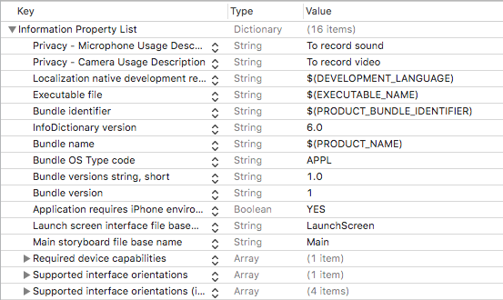

## FrontCameraView


[](https://github.com/pablogsIO/ FrontCameraView)
[](https://github.com/pablogsIO/ FrontCameraView)

A preview front camera UIView in Swift

<p align="center">
    
</p>

### Features

- Preview front camera
- Move the preview UIView to every corner of the screen.
- Record video


### Configure Your App's Info.plist File

iOS requires that your app provide static messages to be displayed to the user when the system asks for camera or microphone permission.

Include the NSCameraUsageDescription and NSMicrophoneUsageDescription key in your app’s Info.plist file.

For each key, provide a message that explains to the user why your app needs to capture media, so that the user can feel confident granting permission to your app.

<p align="center">
    
</p>

## Requirements

Swift 4. Should work with Swift 3

Works on portrait mode

## Example Project

You have a fully functional demo in Example folder

## Usage

### Interface Builder

TO-DO


### Manually

- Drag FrontCameraView.swift and CameraManager.swift into your project
- In your ViewController add the following

```swift
    var capturePreview: FrontCameraView?
    override func viewDidAppear(_ animated: Bool) {
        capturePreview = FrontCameraView(frame: CGRect(x: self.view.frame.size.width/2,
                                                       y: self.view.frame.size.height/2,
                                                       width: self.view.frame.size.width/4,
                                                       height: self.view.frame.size.height/4))
        capturePreview?.delegate = self

        self.view.addSubview(capturePreview!)
    }
```
### Recording video

I've added a Record Button from [here](https://github.com/pablogsIO/RecordButton). Simply add this code to viewDidAppear

```swift
    var recordButton: RecordButton?
    override func viewDidAppear(_ animated: Bool) {
      .
      .
      .
      let recordButtonSide = self.view.bounds.size.height/10
      recordButton = RecordButton(frame: CGRect(x: self.view.bounds.width/2-recordButtonSide/2,
                                                y: self.view.bounds.height/2-recordButtonSide/2,
                                                width: recordButtonSide,
                                                height: recordButtonSide))
      recordButton?.delegate = self

      self.view.addSubview(recordButton!)

    }
```

and conform to RecordButtonDelegate protocol.

```swift
extension ViewController: RecordButtonDelegate {

    func tapButton(isRecording: Bool) {

        if isRecording {
            capturePreview?.startRecording()
        } else {
            capturePreview?.stopRecording()
        }
    }
}
```

### Delegate

The ViewController should conform FrontCameraViewDelegate protocol to know when the video has been recorded.

```swift
extension ViewController: FrontCameraDelegate {

    func videoRecorded(atURL: URL?) {
        guard let url = atURL else { return }
        print("Video has been recorded at: \(url)")
    }

}

```


## Support/Issues
If you have any questions, please don't hesitate to create an issue.

## To-Do
Add Cocoapods

## License
FrontCameraView is available under the MIT license. See the LICENSE file for more info.

If you use it, I'll be happy to know about it.
